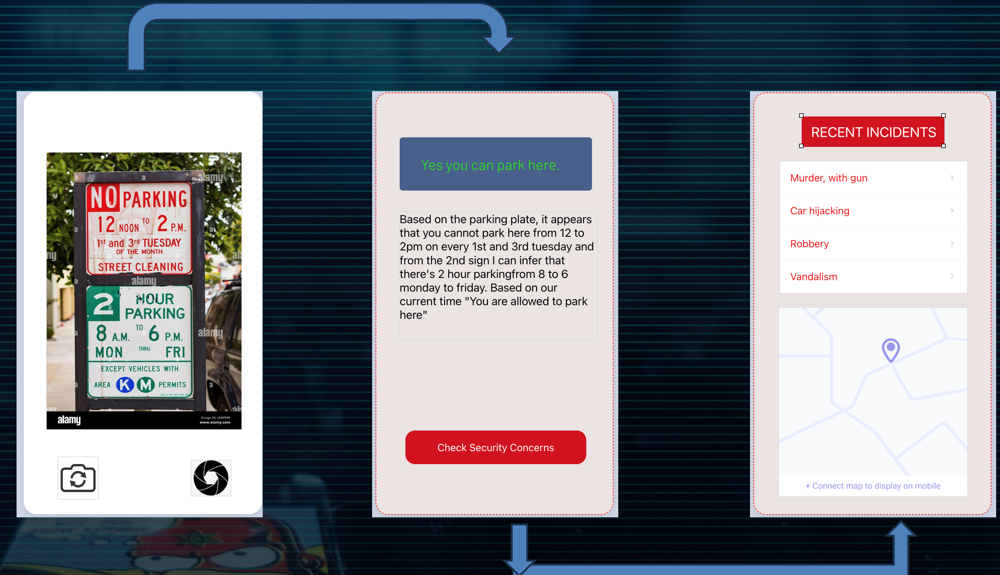

# SmartScanner

SmartScanner is an innovative mobile app designed to decode confusing street parking signs and provide users with real-time insights into safety risks in their area. Built during the University of San Francisco's DonsHack 2024, hosted by Women in Tech (WiT) and ACM, SmartScanner aims to simplify the parking experience in urban environments.

## Features

- **Parking Sign Decoding**: Easily scan street parking signs to determine parking rules and regulations.
- **Safety Insights**: View incidents of car break-ins, robberies, and vandalism in your location to assess safety risks.
- **Intuitive Interface**: User-friendly interface for seamless navigation and quick access to information.

## Technical Details

- **Frontend**: Built with React Native for cross-platform compatibility and a smooth user experience.
- **Backend**: Utilized Flask for the backend to handle data processing and retrieval.
- **OCR Integration**: Integrated OCR (Optical Character Recognition) libraries including Tesseract, EasyOCR, and Keras-OCR to extract text from street signs.
- **OpenAI's GPT-4 Integration**: Leveraged the power of OpenAI's GPT-4 model to interpret and process OCR results for accurate sign decoding.

## Installation

To run SmartScanner locally, follow these steps:

1. Clone the repository:

   ```bash
   git clone https://github.com/Sahil1709/smartscanner.git
   ```

### Starting the server

1. Navigate to the backend directory:

   ```bash
   cd backend
   ```

2. Install dependencies:

   ```bash
   pip install -r requirements.txt
   ```

3. Start the development server:
   ```bash
   flask run
   ```

### Starting the frontend

1. Navigate to the backend directory:

   ```bash
   cd frontend
   ```

2. Install dependencies:

   ```bash
   npm install
   ```

3. Start the development server:

   ```bash
   npm run (web/android/ios)
   ```

## Demo Image



## Contributing

We welcome contributions from the community to enhance SmartScanner's functionality and usability. Feel free to open issues, submit pull requests, or provide feedback on how we can improve.

## License

This project is licensed under the MIT License - see the [LICENSE](https://www.mit.edu/~amini/LICENSE.md) file for details.
